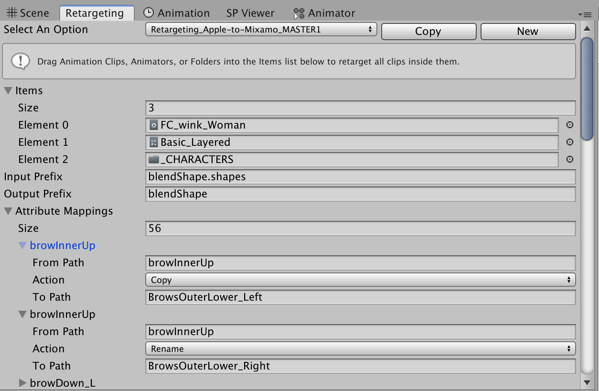

# Animation Retargeting

This is an editor window for the Unity game engine that allows for the retargeting of animations from different paths (aka game objects) and properties(aka keyframes on those objects). The main focus is to allow for the conversion of different items such as blend shapes between different common formats such as Apple's FaceCap and Mixamo's rigs. Allows for:
 * Renaming the paths of game objects from one name to another (for example from `MyGameObject` to `AnotherGameObject`).
 * Renaming properties from one name to another (for example from `browInnerUp` to `BrowsOuterLower_Left`
 * Deleting unnecessary properties (for example if a rig does not support it).
 * Copying one attribute over to a new one (for example to duplicate keys to right and left from a rig that only supports one side).

 
 
# Installation

This package should work on Unity 2018+

You can install this editor through [Unity's package manager](https://docs.unity3d.com/Packages/com.unity.package-manager-ui@1.8/manual/index.html). 

In Unity 2019 you can install the latest from this github by [following these instructions](https://docs.unity3d.com/Manual/upm-ui-giturl.html). 
Alternatively you can add the following to your 'dependencies' in your Packages/manifest.json file:

```
    "com.enemyhideout.retargeting": "https://github.com/robotron2084/animation-retargeting.git#0.0.2",
```

# Usage

First open the utility via `Window->Animation->Retargeting`

Upon first open, you will probably need to select a retargeting preset or create a new one. A retargeting preset defines the actions you want to occur on your animations.

Next you must specify which Animation Clips you would like to modify. You can do this by dragging items into the `Items` UI. You can drag the following items into the UI:
  * Animation Clips
  * Animators - All animation clips inside the animator will be modified.
  * Folders - All animation clips inside the folder will be modified. This includes subfolders.

You must specify a number of 'attribute' or 'path' mapping actions. These are the properties and paths to game objects that you'd like to modify, and how you'd like to modify them. 

#### Attribute Mappings
An attribute is the name of a property that is being animated.
There are three parameters to remapping an attribute:
  * `From Path` - The path, or property that you'd like to modify. For example if you'd like to modify the `Position` of a transform input `Position`.
  * `To Path` - The new name of the property.
  * `Action` - This can be either `Copy`, `Replace`, or `Delete`.
    * `Copy` - Make a copy of this property with the `To Path` name.
    * `Rename` - Rename the property to the `To Path`'s name.
    * `Delete` - Delete this property.

#### Path Mappings
Paths are the paths to a game object. These paths are relative to the location of the `Animator` object in the hierarchy. You can view the path by clicking, then hovering your mouse, and Unity will reveal the whole path. Paths are formatted `grandparent/parent/child` with forward slashes between them.
There are three parameters to remapping a path:
  * `From Path` - The original path.
  * `To Path` - The new path.
  * `MatchType` - Whether you want this to be an exact match and replace.
    * `Exact Match` - Replaces the `From Path` with the `To Path`
      * Example: From: `grandparent/parent/child' To: `grandparent/child` will replace all instances of `grandparent/parent/child' found with `grandparent/child`
    * `Contains` - Replaces instances of `From Path` with instances of `To Path`
      * Example: From: `grandparent` To: `parent` with the path `grandparent/parent/child' will create the path `parent/parent/child`
      * Example: From: `parent/` To: ''(blank) with the path `grandparent/parent/child' will create the path `grandparent/child`
Once you have input your clips and mappings, then press the `Retarget` button, and the tool will iterate over your animation clips and update them. And that's it! A log of all modifications, and any issues, will be displayed in the Console.

## Retargeting Presets
  You can create as many retargeting presets as you need by duplicating an existing preset via `Copy` or creating a new one by selecting `New`. The location the preset is created is determined by the currently selected asset in the Project hierarchy.

# Find this utility helpful? 

Perhaps you will also find my Unity asset [Project Search & Replace](https://assetstore.unity.com/packages/tools/utilities/project-search-replace-55680) helpful.
